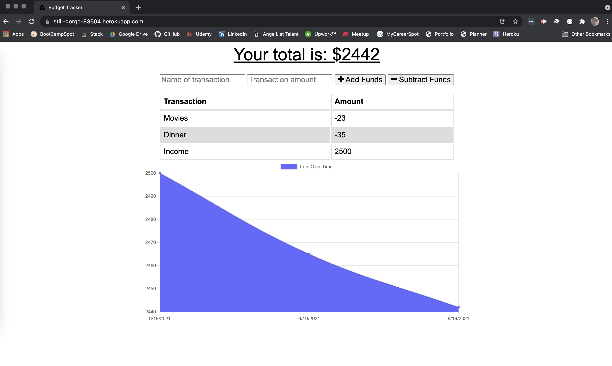
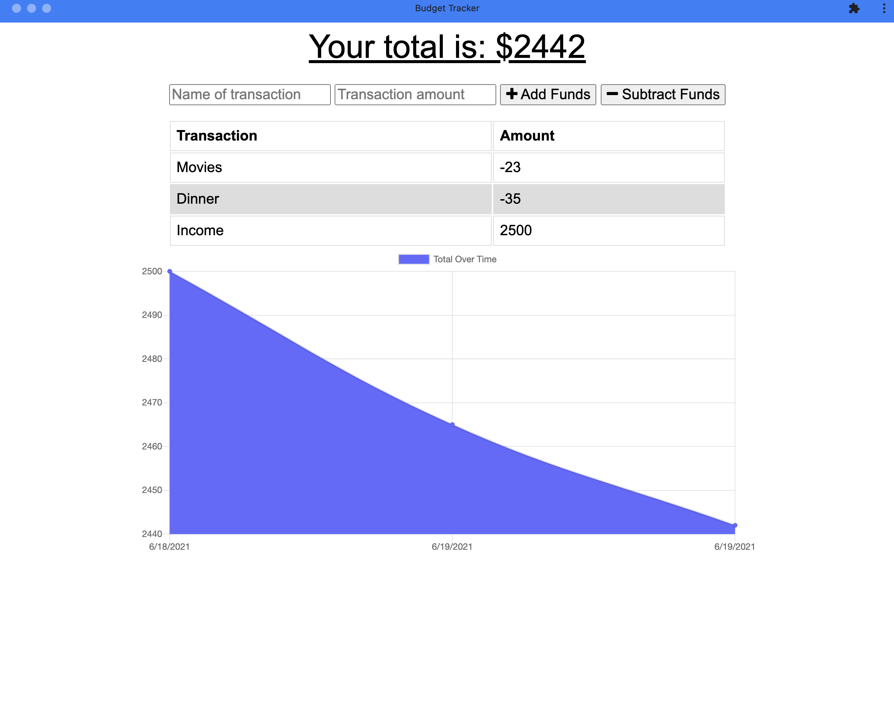
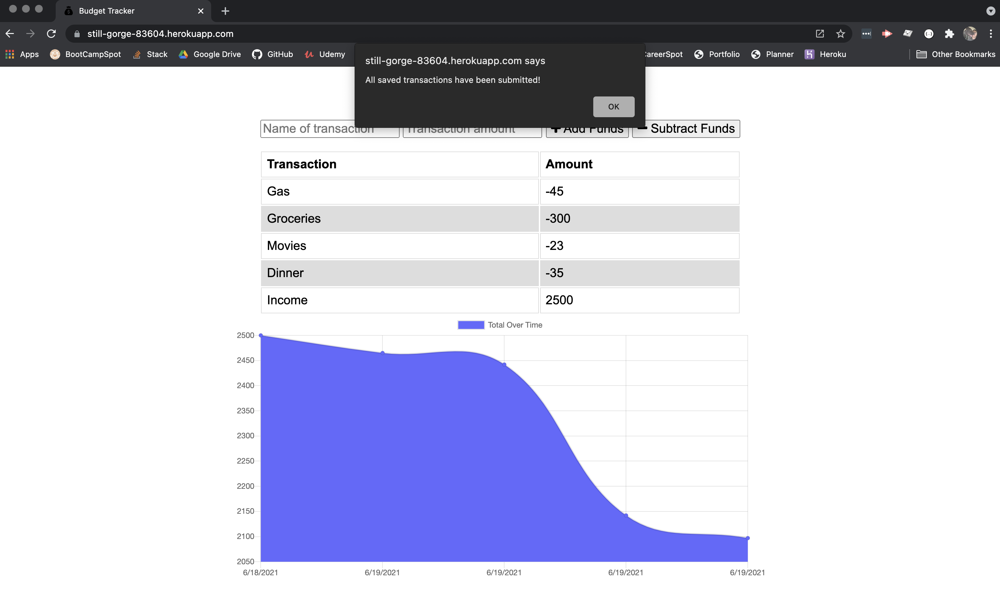

# Budget Tracker

## Description
This application was built to allow users to input deposits or withdrawls on their budget while being on or offline and in the browser or installed on their phone/computer.

----
## Table Of Contents
* [Usage](#usage)
* [Contributions](#contributions)
* [Questions](#questions)

----
## Usage
To use the application, visit the URL [here](https://still-gorge-83604.herokuapp.com/). 

----
## Contributors
Starter code provided by The Coding BootCamp,

[Lacey Griffith](https://github.com/lacey-griffith) implemented IndexDB, Service Worker and manifest for the PWA.

----
## Questions
If you have any questions please contact me at lacey.griffith04@gmail.com.
You can also visit my GitHub profile by clicking [here](https://github.com/lacey-griffith) and the repository for this project can be found [here](https://github.com/lacey-griffith/budget-tracker).

----
## Screenshots

Tracking user transactions while online

Downloaded PWA to computer

Offline transactions posted when reconnected to network.
